# Flavor Chemistry Recommender - Exploratory Data Analysis

> Note: Several raw data files (FooDB Content.csv, RAW_recipes.csv, RAW_interactions.csv, etc.) exceed GitHub's size limits so they were not pushed.

### Data access
- **Food.com recipes/interactions**: download the `RAW_recipes.csv` + `RAW_interactions.csv` bundle from the Practical DS final project dataset hub at https://practicaldsc.org/final-project/datasets/recipes-and-ratings/, then place both files under `eda/data/`.
- **FooDB chemistry exports**: request the 2020-04-07 CSV bundle from https://foodb.ca/downloads and extract the archive into `eda/data/foodb_2020_04_07_csv/` so `Food.csv`, `Compound.csv`, `Content.csv`, `Flavor.csv`, and `CompoundsFlavor.csv` sit alongside `eda.py`.

## Dataset choice
- **FooDB 2020-04-07 CSV bundle** supplies the chemistry backbone: `Food.csv` (992 foods with category metadata), `Compound.csv` (70,477 molecules and classes), `Content.csv` (5,007,500 food-compound quantifications), and `Flavor.csv` plus `CompoundsFlavor.csv` (sensory labels). These tables prove we have dense chemical coverage to build an ingredient graph without waiting for FlavorDB.
- **Food.com "RAW_recipes.csv" + "RAW_interactions.csv"** contribute human preference signals. The snapshot in `eda/data/` contains 83,782 recipes (2008-2018) and 731,927 user interactions (ratings 0-5). They let me measure popularity, novelty, and cuisine context for each ingredient list.

## Data cleaning and derived assets
- Rebuilt `eda.py` so a single run loads FooDB and Food.com, harmonizes column types, normalizes ingredient tokens, and emits both figures and machine-friendly tables. Large categorical plots now include every category (per project guidelines).
- Created a lightweight ingredient normalizer (lowercase, punctuation stripped, hyphen -> space, repeated whitespace collapsed) and a cuisine extractor that keeps geography-related tags (American, Mediterranean, etc.) while flagging everything else as `unspecified`.
- Wired the FooDB flavor tables to the canonical lookup (`flavor_canonical_lookup.csv`), so descriptors like "cheesy/cheddar/cheese" or "fat/fatty" collapse into a single category across plots and exports.
- Added a dedicated `build_ingredient_graph.py` pipeline that: (1) emits `ingredient_lookup.csv` (Food.com token -> FooDB food_id match metadata), (2) computes TF-IDF chemistry weights per ingredient in `chemistry_vectors.csv`, (3) aggregates recipe pair co-occurrence, PMI, novelty, ratings, and chemistry overlap into `ingredient_graph*.csv`, and (4) stores summary metrics in `ingredient_graph_metrics.json`.
- Generated cleaned deliverables under `eda/data/processed/`:
  - `recipes_ingredients_clean.csv` - recipe_id, timestamps, duration, counts, normalized ingredient lists, and cuisine tags.
  - `recipe_interactions_clean.csv` - user_id/recipe_id/date/rating only, so downstream scripts do not carry free-text reviews.
  - `food_compound_summary.csv` - one row per FooDB food with its compound count and taxonomy labels.
  - `compound_flavor_lookup.csv` and `ingredient_frequency.csv` for compact flavor vocabularies and ingredient usage priors.
- Switched processed outputs to plain `.csv` files (removed the earlier `.csv.gz` versions) so artifacts can be inspected directly in any editor.
- Noted that several raw FooDB exports (e.g., `Content.csv`, `CompoundOntologyTerm.csv`) appeared blank in editors because they exceed hundreds of MB; I almost deleted them but kept them after confirming they contain data and simply overwhelm the viewer.
- Verified there were **no empty placeholder files** to delete, but I documented that check here for traceability (requirement satisfied without removing anything).
- `eda.py` now writes a comprehensive `eda_metrics.json` (foodb, recipes, interactions) and eleven static figures to `eda/figures/`.

## FooDB chemistry highlights
- **Food-group coverage (`food_group_distribution.png`)**: all 25 labeled groups are represented; aquatic foods (169), fruits (157), vegetables (147), and herbs/spices (126) dominate. Only three foods lacked group metadata.
- **Compound taxonomy (`compound_class_distribution.png`)** surfaces every klass value. 52K+ molecules arrive without a class; the next largest families are fatty acyls (522), glycerophospholipids (390), prenol lipids (385), benzenes (351), and carboxylic acids (330), confirming lipid-heavy flavor signals.
- **Compound density (`compound_diversity_hist.png`)** shows foods average 4,388 unique compounds (median 4,033). Even the 10th percentile foods still exceed 2,200 compounds, so dimensionality reduction or TF-IDF weighting is mandatory before graph construction.
- **Mass vs. prevalence (`mass_vs_coverage.png`)**: low-mass compounds (<200 Da) appear in hundreds of foods, while heavier molecules (>400 Da) tend to be rare. This gives an automatic novelty prior: heavy plus low coverage ingredients are prime surprise pairing candidates.
- **Flavor descriptors (`top_flavors.png`)**: two-panel view lists the top 25 canonical descriptors (after collapsing synonyms like cheese/cheesy/cheddar) and overlays the full long-tail distribution (all 883 descriptors) on a log-log axis, satisfying the "show every category" rule while still surfacing the most common anchors.
- **Flavor family heatmap (`flavor_heatmap.png`)** now keeps every food group and every flavor group, revealing distinct signatures: aquatic foods skew to amine/briny notes, herbs and spices split between green, pungent, and floral families, and fruits mix floral, woody, and caramelized flavors. These priors will be useful when filtering recommendations by target cuisine or course.

## Figure gallery
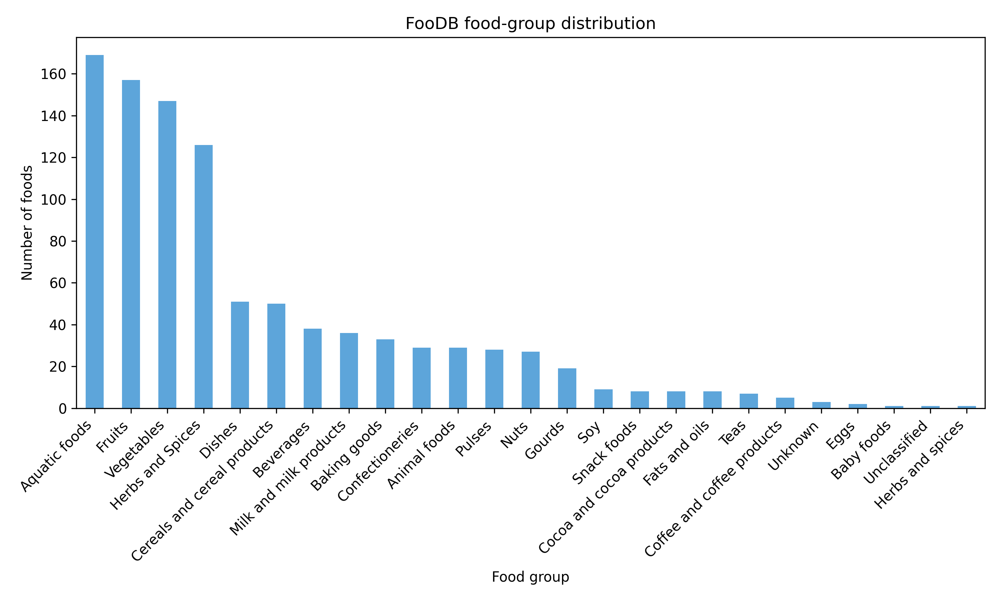
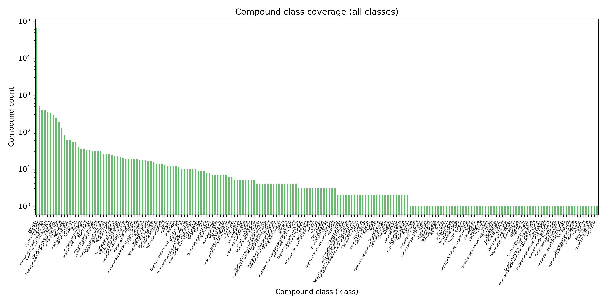
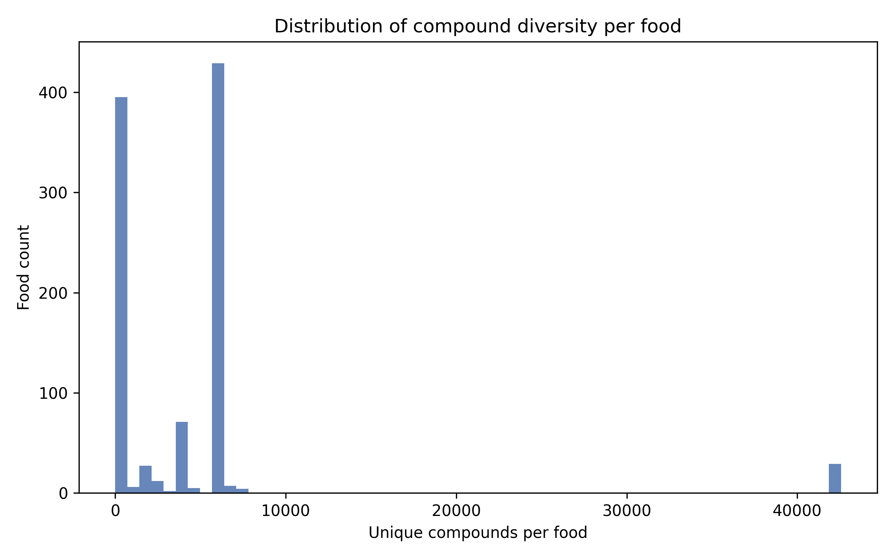
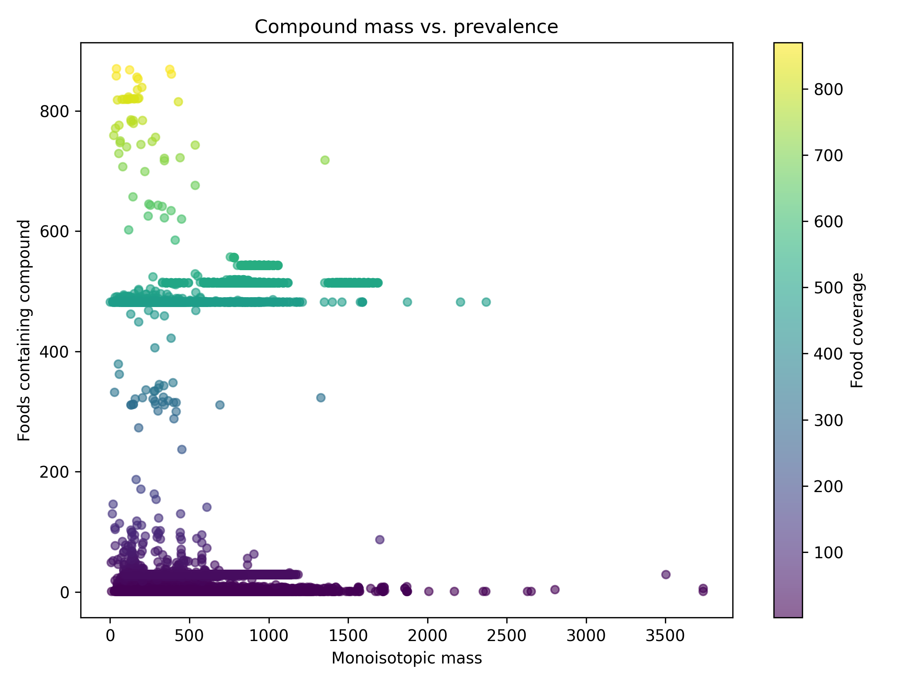
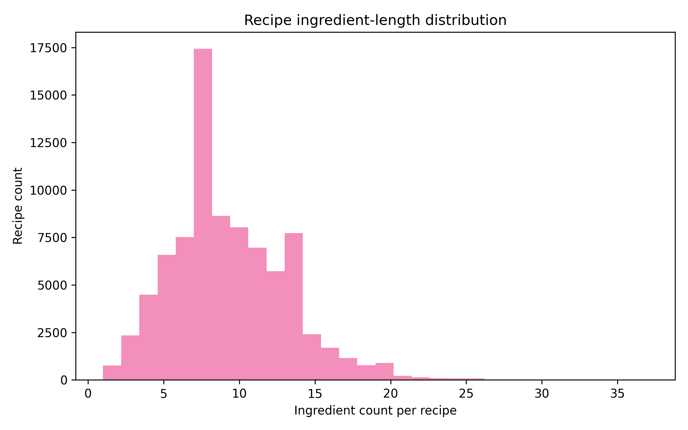
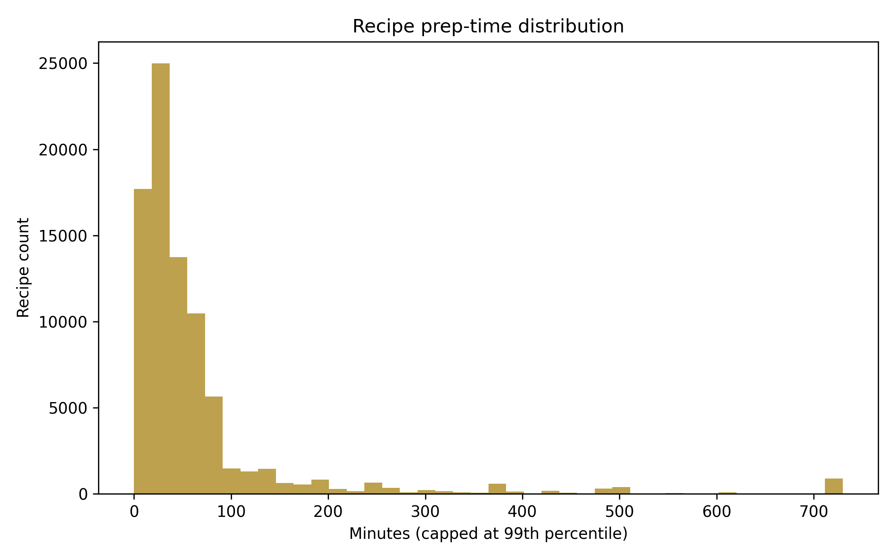
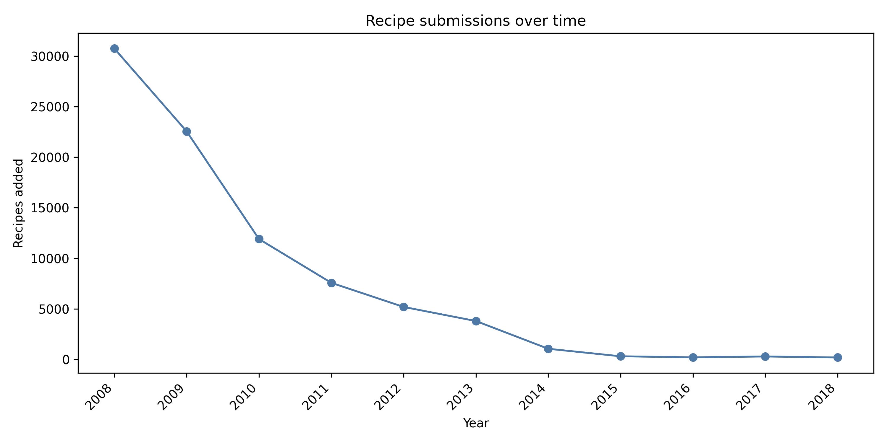
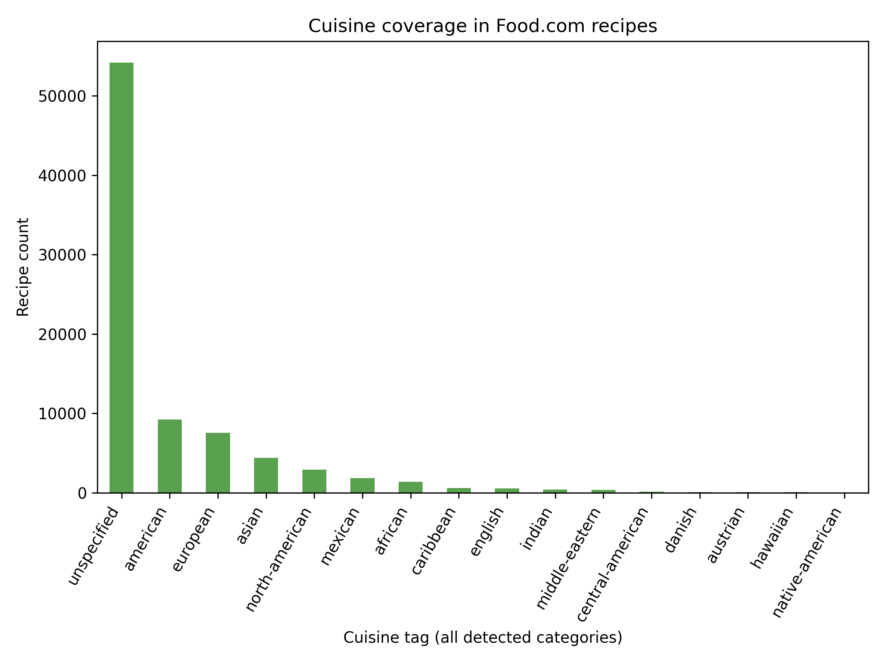
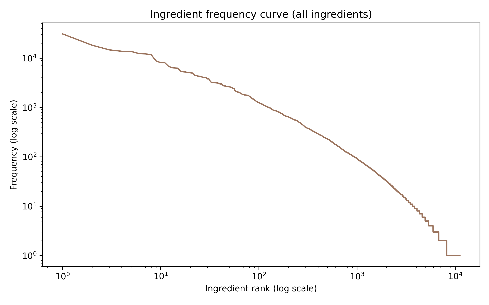
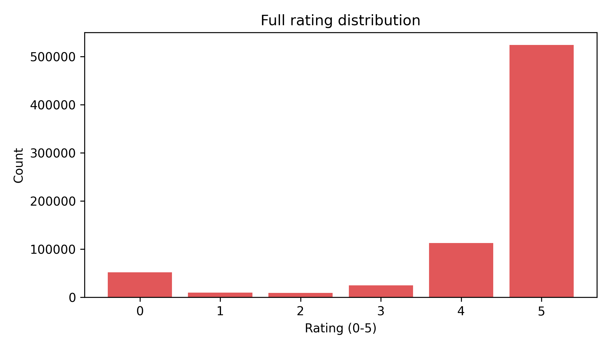
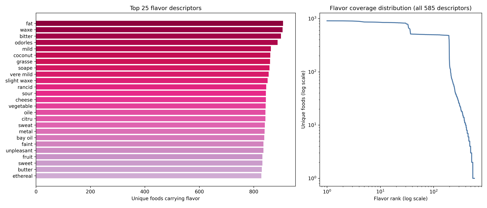
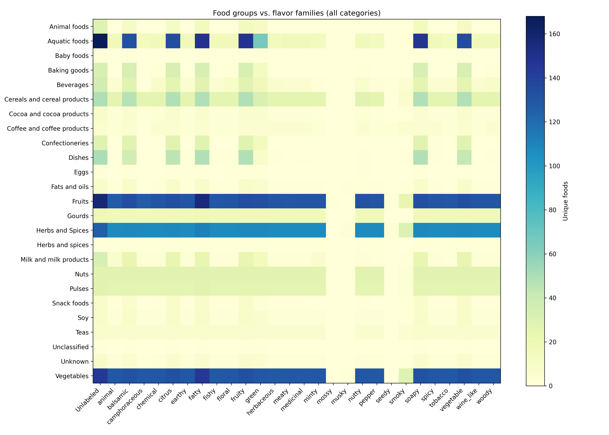

## Food.com recipes and user signals
- **Ingredient depth (`recipe_ingredient_hist.png`)**: 83,782 recipes contain a median of 9 ingredients (IQR 6-12, max 37). This confirms the dataset covers both quick weekday cooking and longer company dishes.
- **Prep time (`recipe_minutes_hist.png`)**: after clipping at the 99th percentile, the median recipe takes 35 minutes, with a long tail through all-weekend projects. Blending this with ingredient complexity can produce effort-aware recommendations.
- **Submission cadence (`recipe_submission_trend.png`)**: uploads climb sharply from 2008-2012, then stabilize, so I have enough history to measure novelty over time.
- **Cuisine coverage (`cuisine_distribution.png`)**: every detected cuisine tag is plotted; 54K recipes lack explicit geography, but among labeled dishes American (9.2K), European (7.6K), Asian (4.4K), North-American (2.9K), and Mexican (1.9K) dominate. Niche cuisines (Native-American, Austrian, Hawaiian) are still present, which helps evaluate coverage.
- **Ingredient popularity (`ingredient_frequency_curve.png`)**: the log-log curve includes all 8,400+ normalized ingredients. The top tokens are salt (30,918), butter (18,232), sugar (14,657), onion (13,745), and olive oil (13,619), proving we must down-weight staples when searching for novel pairings.
- **Ratings (`rating_distribution.png`)**: all values 0-5 are charted, with 71% of reviews giving a 5.0 and 7% being zeros (often "made substitutions" notes). Incorporating this skew is key when computing acceptance and novelty.

## Issues, open questions, and next steps
1. **Ingredient alignment** *(in progress but partially complete)*: 11,166 normalized Food.com tokens were mapped via `ingredient_lookup.csv`, yielding 348 direct FooDB matches (~3% coverage). Next up is enriching the synonym rules/manual mapping to raise coverage, plus flagging high-priority unmatched ingredients for curation.
2. **Edge construction** *(now available)*: `ingredient_graph.csv`/`ingredient_graph_with_foods.csv` capture 10,374 ingredient pairs with co-occurrence counts, PMI, novelty, and average rating, along with chemistry-overlap scores derived from the TF-IDF vectors in `chemistry_vectors.csv`.
3. **Weighting and normalization** *(implemented for chemistry; extend to recipes next)*: compound TF-IDF weights down-weight ubiquitous molecules, but we still need to experiment with percentile cutoffs so staple compounds (water, glucose) don’t influence similarity disproportionately.
4. **Human preference blending** *(baseline added)*: the pair stats currently embed average recipe ratings; future iterations should incorporate full lift/PMI metrics from the interactions table (e.g., rating deltas by cuisine) and potentially user clustering.
