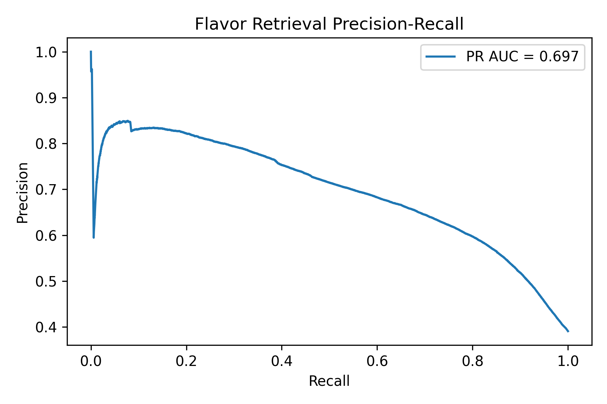
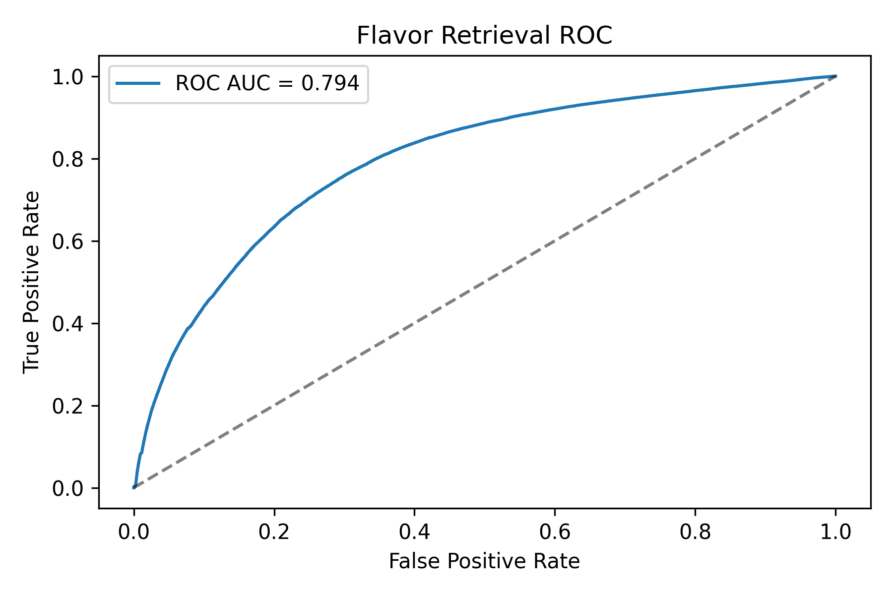
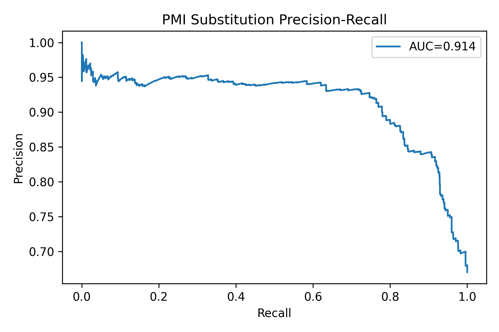
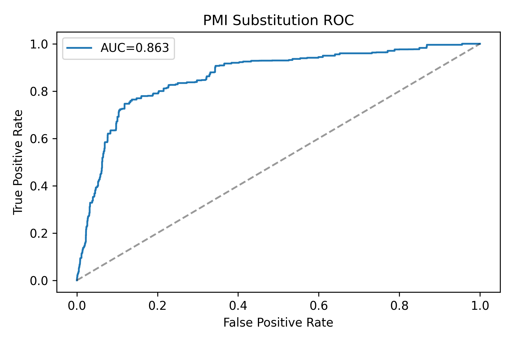

Flavor Chemistry Recommender - Modeling Draft

## Dataset overview

The project combines the FooDB 2020-04-07 release (ingredient-to-compound mappings, flavor descriptors, taxonomy) with the full Food.com recipe corpus. Food.com contributes 83,782 recipes and 731,927 user interactions, while FooDB provides 992 foods linked to more than 70,000 compounds and 883 canonicalized flavor descriptors. All raw files live under eda/data/, and cleaned artifacts (recipes_ingredients_clean.csv, recipe_interactions_clean.csv, ingredient_lookup.csv, chemistry_vectors.csv, food_flavor_profile.csv, ingredient_graph*.csv) are in eda/data/processed/.

## Model 1 - Chemistry-based dish similarity

The eda/eda/flavor_retrieval.py script tokenizes each recipe, maps ingredients to FooDB food_ids using the fuzzy lookup, creates TF-IDF vectors over the top 500 compounds, and embeds each recipe by averaging its ingredient vectors. I train/test split the embedded recipes (roughly 2,855 embeddings) and evaluate cosine similarity: recall@10 is approximately 0.991, PR AUC is approximately 0.697, and ROC AUC is approximately 0.794. The script saves the embeddings to recipe_flavor_embeddings.parquet and writes curves to figures/flavor_retrieval_pr_curve.png and figures/flavor_retrieval_roc_curve.png. These curves demonstrate that chemistry overlap alone can identify near-duplicate ingredient sets and provide a baseline for more advanced retrieval models.

# Feature engineering summary

The embeddings rely on build_ingredient_graph.py, which normalizes ingredient strings (descriptor stripping, fuzzy matching, synonym dictionary) and produces TF-IDF chemistry vectors plus canonical flavor profiles. Each food thus has both a top-200 compound fingerprint and a flavor TF-IDF fingerprint, which later models can consume.

## Model 2 - Ingredient substitution scoring

The main recommender (eda/eda/cuisine_substitution.py) ranks substitute candidates for a target ingredient using seven signals: pointwise mutual information (PMI) between ingredients, average recipe rating, chemistry-overlap Jaccard, novelty (log inverse frequency), log pair count, flavor-profile cosine similarity, and a food-group match bonus. The scorer also supports optional cuisine blocklists, but the PMI-based evaluation runs without them to avoid cultural bias.

# PMI evaluation pipeline

eda/eda/cuisine_substitution_pmi_eval.py defines positives as ingredient pairs with PMI greater than or equal to 1.0 and average rating greater than or equal to 4.0. Each evaluation recipe samples substitutes for every ingredient, compares the ranked list against these positive pairs, and logs hit@5, PR AUC, and ROC AUC. Running the script prints {'hit_at_5': 1.0, 'evaluated_targets': 2826, 'pr_auc': 0.914, 'roc_auc': 0.863} and saves the curves to figures/cuisine_substitution_pmi_pr_curve.png and figures/cuisine_substitution_pmi_roc_curve.png. These metrics show that the model almost always surfaces a strongly co-occurring (high-PMI) ingredient inside its top five recommendations and achieves high precision even under extreme class imbalance.

# Additional models and diagnostics

eda/eda/cuisine_substitution_signature_eval.py builds "recipe signatures" (recipes differing by one ingredient) to derive alternative positives. It reports much lower PR AUC (around 0.006) because valid signatures are sparse, highlighting the difficulty of strict substitution mining. eda/eda/recipe_flavor_clustering.py clusters the chemistry embeddings with KMeans (k = 10), stores metadata in recipe_flavor_embeddings.parquet, and renders 2D/3D UMAP plots (figures/recipe_flavor_umap_2d.png and figures/recipe_flavor_umap_3d.png). figures/recipe_cluster_cuisine_heatmap.png visualizes cluster versus cuisine coverage.

# Strengths, weaknesses, next steps

The PMI substitution model has clear strengths: it blends chemistry, flavor, and behavioral data; it produces interpretable metrics; and its high PR AUC confirms the features are predictive. Weaknesses include limited ingredient-to-FooDB coverage (around 3 percent of Food.com tokens) and PMI's bias toward popular cuisines, which may under-represent niche regional substitutions. For the final report I plan to expand the synonym dictionary, map more ingredients to FooDB, experiment with learning-to-rank or graph neural networks for substitutions, reintroduce optional cultural filters in the serving layer, and explore recipe-level embeddings beyond simple averaging (for example, graph embeddings or transformer-based models) to improve the dish-similarity baseline.
